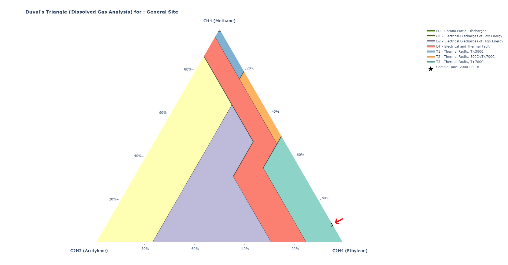

# Duval's Triangle Plotter

Duval's Triangle Plotter is a Python library for generating Duval's Triangle plots, which are commonly used in Dissolved Gas Analysis (DGA) for monitoring power transformers.

## Introduction

Duval's Triangle is a graphical representation used in DGA to analyze the concentration levels of different gases, such as methane, acetylene, and ethylene, dissolved in transformer oil. This project provides a Python library that allows users to easily create Duval's Triangle plots for their DGA data.

## Features

- Generate Duval's Triangle plots with customizable configurations.
- Plot various regions on Duval's Triangle, such as PD (Partial Discharges), D1, D2, DT, T1, T2, and T3.
- Customize layout, colors, and symbols for better visualization.

## Getting Started

### Installation
```bash
pip install duvals-triangle-plotter==1.0
```

### Usage
```python
import duvals_triangle_plotter as dtp

methane_points_list = [0.09] # units = ppm
acetylene_points_list = [0.0] # units = ppm
ethylene_points_list = [0.91] # units = ppm
date = "2000-08-16"

# Call the function to get Duval's Triangle traces
duval_trace = dtp.get_duval_points_traces(methane_points_list, acetylene_points_list, ethylene_points_list, date)

# Call the function to get Duval's Triangle plot
fig = dtp.get_duvals_triangle_plot([duval_trace], True)
```

### Output


## Additional information
Duval's Triangle is a graphical representation used in Dissolved Gas Analysis (DGA), which is a diagnostic technique employed in the field of power transformers. DGA involves analyzing the concentration of gases dissolved in the insulating oil of a transformer. By monitoring and interpreting the presence and quantities of specific gases, analysts can gain insights into the condition of the transformer and identify potential issues.

Here's an overview of Duval's Triangle and its significance:

1. Duval's Triangle:
Representation: Duval's Triangle is a ternary plot, also known as a Gibbs triangle, that displays the relative concentrations of three key gases: methane (CH₄), acetylene (C₂H₂), and ethylene (C₂H₄).
Axes: The three vertices of the triangle correspond to 100% concentration of each gas, and the sides represent binary mixtures of the adjacent gases.
2. Significance and Usage:
Fault Detection: Duval's Triangle is primarily used in the context of DGA to identify and classify various types of faults or abnormal conditions within power transformers.
Gas Production: Different types of electrical and thermal faults within a transformer produce characteristic gases. Monitoring the changes in gas concentrations helps in early detection of potential issues.
Fault Regions: Different regions within Duval's Triangle correspond to specific fault types. For example, Partial Discharges (PD), electrical discharges of low and high energy (D1 and D2), electrical and thermal faults (DT), and various thermal faults (T1, T2, and T3) have distinct regions.
3. Value and Benefits:
Early Warning: Duval's Triangle provides a visual and quantitative way to assess the condition of a transformer based on the DGA results. Early detection of faults allows for preventive maintenance and avoids costly unplanned downtime.
    - Diagnostic Insight: Each region in Duval's Triangle corresponds to a specific fault mechanism, providing valuable diagnostic information. This allows maintenance teams to pinpoint the nature of a potential issue.
    - Data Interpretation: Analysts can interpret the trends and changes in gas concentrations over time to assess the transformer's health and make informed decisions about maintenance or replacement.

In summary, Duval's Triangle is a powerful tool in the field of transformer diagnostics, offering a systematic and visual approach to interpreting Dissolved Gas Analysis results. It plays a crucial role in predictive maintenance strategies for ensuring the reliability and longevity of power transformers in electrical power systems.

## Additional links:
1. https://powertransformerhealth.com/2019/03/22/duvals-triangle-method/
2. https://www.reinhausen.com/the-duval-triangle-explained-in-3-minutes