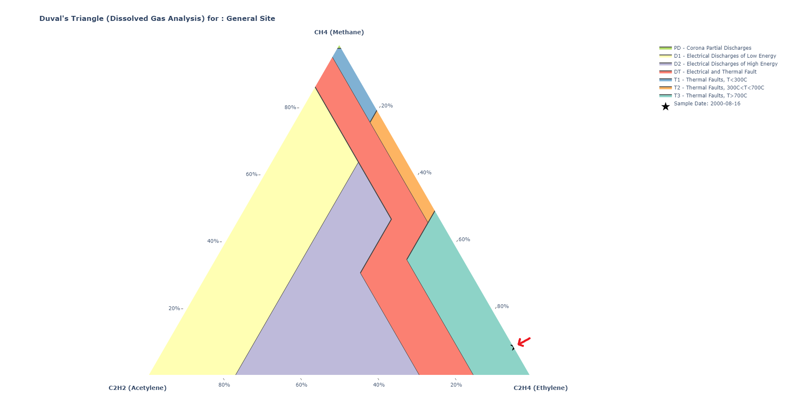

# Duval's Triangle Plotter

Python library for generating Duval's Triangle plots — a ternary diagnostic
tool used in Dissolved Gas Analysis (DGA) for power transformer condition
monitoring.

[](https://pypi.org/project/duvals-triangle-plotter/)
[](https://github.com/nagusubra/duvals_triangle_plotter/blob/main/LICENSE.txt)
[](https://pypi.org/project/duvals-triangle-plotter/)
[](https://github.com/nagusubra/duvals_triangle_plotter)

## What is Duval's Triangle?

Duval's Triangle is a ternary plot that visualises the relative concentrations
of methane (CH<sub>4</sub>), acetylene (C<sub>2</sub>H<sub>2</sub>), and
ethylene (C<sub>2</sub>H<sub>4</sub>) dissolved in transformer oil. Different
regions of the triangle correspond to distinct fault types, making it a
standard diagnostic tool in power transformer condition monitoring.

<figure markdown>
{ loading=lazy }
<figcaption>Example plot showing the seven fault regions with a data point from a 2000-08-16 sample.</figcaption>
</figure>

## Why use this library?

Manually plotting Duval's Triangle requires careful calculation of gas ratios
and region boundaries. This library automates the entire process: provide gas
concentrations and receive a publication-ready, interactive Plotly figure with
all seven fault regions shaded and labelled.

<div class="grid cards" markdown>

-   **Ternary Plots** — Generate publication-ready Duval's Triangle plots
    from gas concentration data.
-   **Fault Regions** — Seven standard zones: PD, D1, D2, DT, T1, T2, and T3,
    each with a distinct colour.
-   **Customisable** — Adjust layout dimensions, axis titles, marker symbols,
    and equipment labels.
-   **Plotly Backend** — Built on Plotly — interactive, zoomable figures that
    render in Jupyter notebooks and browsers.

</div>

## Installation

```bash
pip install duvals-triangle-plotter
```

[Full installation guide &rarr;](installation.md)

## Quick Start

```python
import duvals_triangle_plotter as dtp

# concentrations in ppm
methane   = [0.09]
acetylene = [0.0]
ethylene  = [0.91]
date      = "2000-08-16"

trace = dtp.get_duval_points_traces(
    methane, acetylene, ethylene, date
)

fig = dtp.get_duvals_triangle_plot(
    [trace], show_plot=True
)
```

[Full quick start guide &rarr;](quickstart.md)

## Documentation

- [Installation](installation.md) — pip instructions, dependencies, Python version support
- [Quick Start](quickstart.md) — minimal working example with input and output explanation
- [API Reference](api-reference.md) — complete function documentation
- [Fault Regions](fault-regions.md) — detailed explanation of the seven fault types
- [Duval's Triangle Explained](duvals-triangle-explained.md) — in-depth guide to the method
- [Examples](examples.md) — code snippets for common use cases
- [FAQ](faq.md) — answers to common questions

## Frequently Asked Questions

**What is Duval's Triangle?**

Duval's Triangle is a graphical method for interpreting Dissolved Gas
Analysis (DGA) data. It plots three hydrocarbon gases (methane, acetylene,
ethylene) as percentages on a ternary diagram and identifies fault types based
on which region the data point falls in.

**How do I install this library?**

Run `pip install duvals-triangle-plotter`. Requires Python 3.6+ and Plotly 5+.
See the [Installation page](installation.md) for details.

**What inputs does the library expect?**

Three lists of gas concentrations (methane, acetylene, ethylene) in ppm, plus
a date or label string for each sample.

[View all FAQ &rarr;](faq.md)

## Additional Resources

- [GitHub Repository](https://github.com/nagusubra/duvals_triangle_plotter)
- [PyPI Project Page](https://pypi.org/project/duvals-triangle-plotter/)
- [Duval's Triangle Method — Power Transformer Health](https://powertransformerhealth.com/2019/03/22/duvals-triangle-method/)
- [The Duval Triangle Explained in 3 Minutes — Reinhausen](https://www.reinhausen.com/the-duval-triangle-explained-in-3-minutes/)
